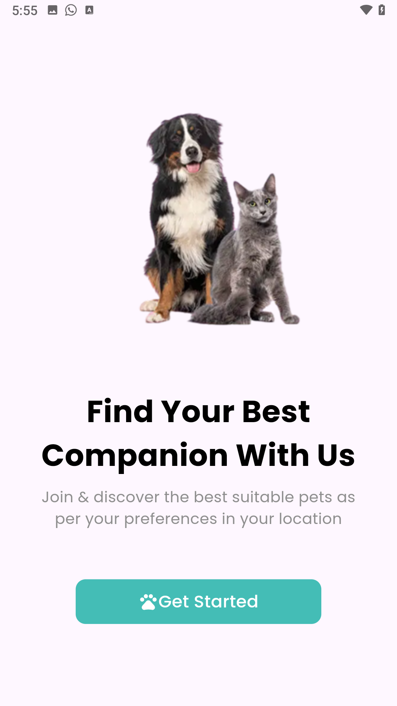
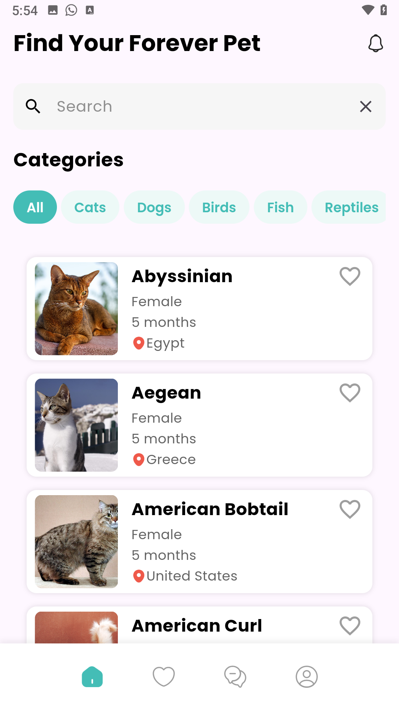
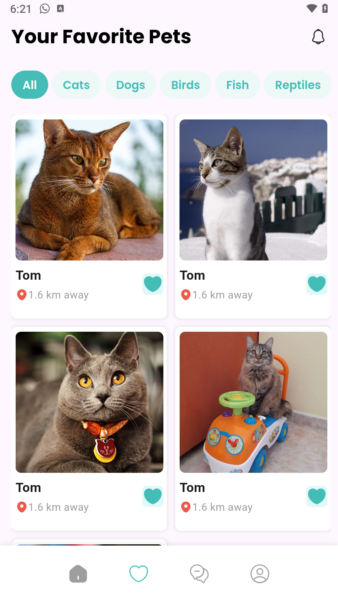

# 🐾 Pets Finder App

A simple and elegant **Pet Discovery App** built using **The Cat API**, where users can **view, search, and favorite pets** based on their preferences and location.

---

## 📱 Overview

**Pets Finder App** allows users to explore various pets (cats) from [The Cat API](https://thecatapi.com/), search or filter them by breed, and mark their favorites for easy access later.

This project demonstrates the use of **Flutter clean architecture**, **state management (Cubit/BLoC)**, **networking**, and **testing (unit, widget, integration)** to ensure a complete and robust app experience.

---

## 🎨 API Resources

- **API Collection:** [🔗 Cat API Documentation](https://docs.thecatapi.com/)

---

## 🚀 App Features

### 🐈 Core Features

1. **View Pets:**  
   Browse and view detailed pet information fetched from **The Cat API**.

2. **Add to Favorites:**  
   Save your favorite pets to a personalized list for easy viewing later.

3. **Search or Filter:**  
   Quickly find pets by **breed** or user preferences with search and filtering capabilities.

---

## 🧩 Tech Stack

- **Framework:** Flutter (Dart)
- **State Management:** Cubit / BLoC
- **Networking:** Dio
- **Dependency Injection:** get_it
- **Architecture:** Clean Architecture (Data → Domain → Presentation)
- **Testing:** Flutter Test / Mockito / Integration Test

---

## 🧪 Testing

The app includes **three levels of testing** to ensure complete functionality and reliability:

| Test Type | Description |
|------------|-------------|
| **Unit Tests** | Test business logic and data handling (e.g., favorite handling, search logic) |
| **Widget Tests** | Validate UI components and widget tree behavior |
| **Integration Tests** | Simulate real user flows (view pets → search → add to favorites) |

✅ **All tests are implemented and passing.**

To run the tests locally:
```bash
flutter test
```
---

### ⚙️ Setup

1. **Clone the repository**
   ```bash
   git clone https://github.com/Israa050/Pets-Finder.git
   cd flutter_ecommerce_app

2. **Install dependencies**
  ```bash
   flutter pub get
  ```
3. **Run The app**
  ```bash
   flutter run
  ```
  ---


## 🖼️ Screenshots

| OnBoarding | Home | Favorite |
|:------:|:-----------:|:-----:|
|  |  |  |

---


